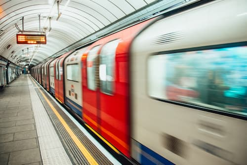

# london-travel-network

London, or as the Romans called it "Londonium"! As of 2021, Greater London is home to over 8.5 million residents who speak over 300 languages. While the City of London is a little over one square mile (hence its nickname "The Square Mile"), Greater London has grown to encompass 32 boroughs spanning a total area of 606 square miles! 

Given the city's roads were originally designed for horse and cart, this area and population growth have required the development of an efficient public transport system! Since the year 2000, this has been through the local government body called **Transport for London**, or *TfL*, which is managed by the London Mayor's office. Their remit covers the London Underground, Overground, Docklands Light Railway (DLR), buses, trams, river services (clipper and Emirates Airline cable car), roads, and even taxis.

The Mayor of London's office makes their data available to the public [here](https://data.london.gov.uk/dataset). In this project, you will work with a slightly modified version of a dataset containing information about public transport journey volume by transport type. 

The data has been loaded into a **Databricks** database containing a schema called `tfl` with a single table called `journeys`. The table, which you will use for the project, includes the following data:

## `tfl.journeys`

| Column | Definition | Data type |
|--------|------------|-----------|
| `month`| Month in number format, e.g., `1` equals January | `integer` |
| `year` | Year | `integer` |
| `days` | Number of days in the given month | `integer` |
| `report_date` | Date that the data was reported | `date` |
| `journey_type` | Method of transport used | `varchar` |
| `journeys_millions` | Millions of journeys, measured in decimals | `float` |

The following three questions are answered in this project using SQL queries:
1. What are the most popular transport types?
2. What are the top 5 months and years where Emirates Airlines experience the most popularity?
3. What are the 5 years in which tube type of transport experienced the least popularity?